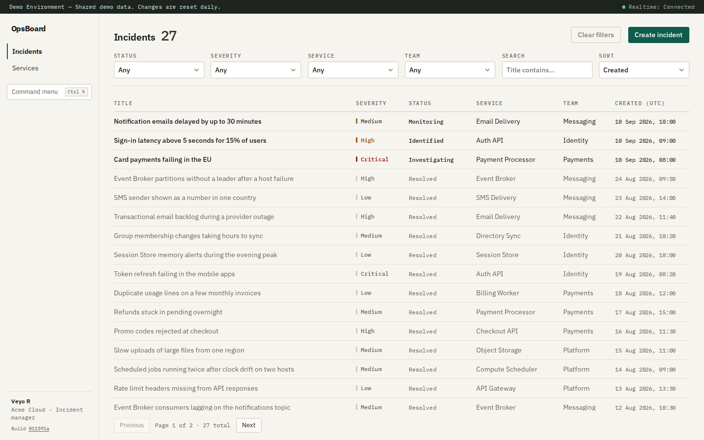
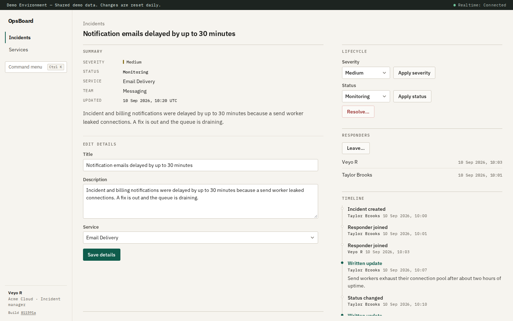

# OpsBoard

Real-time incident and service operations management platform. Portfolio application demonstrating senior Angular frontend engineering, ASP.NET Core API design, EF Core/PostgreSQL persistence, SignalR, testing, accessibility, and containerised delivery. Delivery status is in the [roadmap](#roadmap).

## Screenshots





## Live demo

[opsboard.app.rgpl.xyz](https://opsboard.app.rgpl.xyz) is a shared public instance of the demonstration stack. There is no sign-in: every visitor acts as the seeded Acme Cloud incident manager, so changes are visible to everyone else using it. The data returns to the seeded state every day at 18:00 UTC.

## Technology stack

| Layer | Choice |
| --- | --- |
| Frontend | Angular 22, TypeScript (strict), Signals, TanStack Query, RxJS, SCSS |
| Backend | ASP.NET Core 10, EF Core, FluentValidation, SignalR |
| Data | PostgreSQL 17 |
| Delivery | Docker images for the API and web (nginx), Docker Compose, GitHub Actions |
| Tooling | mise (Node + .NET SDK pins), xUnit, Testcontainers, Vitest, Playwright, axe-core |

## Repository structure

```text
OpsBoard/
├── apps/web/                 # Angular SPA (feature-oriented)
│   ├── src/app/
│   │   ├── core/             # realtime connection, route focus
│   │   ├── data-access/      # HTTP clients, contracts, Query keys, queries, mutations
│   │   ├── features/         # incidents, services (+ empty folders for later features)
│   │   ├── layout/           # shell, navigation, demo banner, command palette
│   │   └── shared/           # accessible UI primitives, focus helpers, URL sync, permissions
│   ├── e2e/                  # browser journeys and accessibility checks
│   ├── Dockerfile            # built frontend served by nginx
│   └── nginx.conf            # static files + /api and /hubs proxy
├── src/
│   ├── OpsBoard.Api/         # HTTP host, endpoints, SignalR hub, error mapping, Dockerfile
│   ├── OpsBoard.Application/ # DTOs, use cases, validation, permissions
│   ├── OpsBoard.Domain/      # entities, enums, lifecycle rules
│   └── OpsBoard.Infrastructure/ # EF Core, migrations, demo seed, demo identity
├── tests/
│   ├── OpsBoard.UnitTests/
│   └── OpsBoard.IntegrationTests/
├── docs/                     # architecture, API, testing, accessibility, deployment, ADRs
├── scripts/check-stack.sh    # proves a running container stack answers
├── .github/workflows/ci.yml  # automated build and test run
├── docker-compose.yml        # PostgreSQL, or the full demonstration stack
├── mise.toml                 # Node 24.21 + .NET 10.0.401
└── OpsBoard.sln
```

## Architecture overview

- **TanStack Query**: all server state (fetch, cache, mutations, invalidation)
- **Signals**: local UI / client state; server data is never copied into them
- **RxJS**: event streams: realtime facts, debounced search
- **SignalR**: committed-change notifications, which the client turns into Query invalidations
- **PostgreSQL**: system of record

## Documentation

- [Architecture](docs/architecture.md): system shape, backend layers and the realtime flow, with diagrams
- [Frontend architecture](docs/frontend-architecture.md): structure, state ownership, forms and failure handling
- [API design](docs/api-design.md): resources, paging, filtering, the error contract and optimistic concurrency
- [Testing strategy](docs/testing-strategy.md): what each test tier owns, and what coverage means here
- [Accessibility](docs/accessibility.md): the contracts the application keeps and which are verified
- [Deployment](docs/deployment.md): what changes outside the demonstration stack
- Decision records: [server state](docs/adr/0001-server-state-ownership.md), [client state](docs/adr/0002-client-state-ownership.md), [realtime orchestration](docs/adr/0003-realtime-orchestration.md)

## What works today

- **Demo identity + Acme seed**: organization, teams, users, services, historical and active incidents
- **Incidents API + UI**: paged/filtered list (URL-backed filters), create, detail, edit, severity/status/resolve/reopen, join/leave, written updates, timeline, with conflict recovery
- **Services API + UI**: paged/filtered list, detail and edit with conflict recovery; creation through the API
- **Realtime**: incident changes made by one user appear in other open browsers, with reconnect recovery and a connection status in the shell
- **Command palette**: Ctrl+K / Cmd+K search and navigation across incidents, services and commands
- **Accessibility**: route focus, dialog focus handling, visible focus, polite status announcements, text cues for severity/status/health
- **Shared UI**: severity/status/health badges, pagination, callouts, confirm dialog
- **Shell**: demo environment banner, Incidents/Services navigation, identity chrome
- **Delivery**: container images, a one-command demonstration stack, and an automated build-and-test run on every push and pull request

Not yet: dashboard summary UI, teams/users/postmortems screens, a service-create screen, realtime updates for services, and sign-in with a real identity provider.

## Local setup

### Prerequisites

- [mise](https://mise.jdx.dev/) (or install Node 24.15+ and the .NET 10 SDK manually)
- Docker / Docker Compose
- Git

From the repository root:

```bash
mise trust && mise install
cp .env.example .env
docker compose up -d postgres
dotnet tool restore
```

### Database

Migrations are not applied on API startup. Apply them, then seed once:

```bash
dotnet ef database update \
  --project src/OpsBoard.Infrastructure \
  --startup-project src/OpsBoard.Api

ASPNETCORE_ENVIRONMENT=Development \
  dotnet run --project src/OpsBoard.Api --no-launch-profile -- --seed-demo
```

Re-running `--seed-demo` is a no-op when the Acme marker is present.

### Backend

```bash
dotnet restore OpsBoard.sln
dotnet build OpsBoard.sln
dotnet run --project src/OpsBoard.Api --launch-profile http
# Health: GET http://localhost:5233/api/health
```

### Frontend

Requires **Node ≥ 24.15** (24.21 is pinned in `mise.toml`) and **npm ≥ 11**. Dev proxy targets the local API.

```bash
cd apps/web
npm ci
npm start
# http://localhost:4200
```

If `ng` reports an unsupported Node version while mise is installed, make sure mise's Node is first on `PATH` (`hash -r` after `mise activate`, or open a fresh shell in the repository root). A Node bundled with an editor or other tool can otherwise shadow the project's pinned version.

## Testing commands

```bash
# Backend unit + integration
dotnet test OpsBoard.sln

# Frontend unit tests (Vitest via Angular)
cd apps/web && npm test

# Browser journeys + accessibility checks (Playwright, Chromium)
cd apps/web && npm run test:e2e

# Coverage, reported rather than gated
dotnet test OpsBoard.sln --collect:"XPlat Code Coverage"
cd apps/web && npm test -- --coverage
```

**Backend.** The integration tests create a uniquely named database per run, apply migrations, and drop it afterwards. They use `OpsBoardTests__AdminConnection` or `ConnectionStrings__OpsBoard` when either is set, and otherwise start `postgres:17-alpine` themselves for the run, so a clean checkout needs no manual step. With neither a connection nor a container runtime available they fail immediately and name both remedies.

**Frontend.** Component and service specs run in jsdom and collect only from `apps/web/src`.

**Browser.** The tier lives in `apps/web/e2e` and needs a one-off `npx playwright install chromium`. Its setup brings up the database container, applies migrations and runs the demo seed, then starts the API and the dev server, reusing either if it is already running. The journeys create the records they change, so they can be run repeatedly. Any accepted accessibility violation is listed with its reason in `apps/web/e2e/a11y-accepted.json`, which is currently empty.

**Automated run.** `.github/workflows/ci.yml` runs every tier above on each push and pull request, then builds the images, starts the container stack on an empty database and runs the stack check against it.

## Docker commands

The database on its own, for the local development setup above:

```bash
docker compose up -d postgres
docker compose ps
docker compose down
```

The whole application as a **demonstration stack**, needing only Docker (and `curl` for the check script):

```bash
docker compose up -d --wait   # builds the images, applies the schema, seeds the demo data
# http://localhost:8080  (set WEB_PORT to change the port)
./scripts/check-stack.sh      # proves the stack answers as the seeded demo user
docker compose down
```

To have the application name the commit it was built from, pass the full commit: `GIT_SHA=$(git rev-parse HEAD) docker compose up -d --wait`. Without it the build reads `dev`.

`--wait` returns once the application answers. The stack runs a one-shot step that applies the schema and then the demo seed, which only runs in the `Development` environment, so that step, and only that step, runs as Development. The API only starts once that step has succeeded. It is a demonstration, not a production configuration. [Deployment](docs/deployment.md) describes what changes in a real deployment.

The stack and the local development setup share the same PostgreSQL container and volume. `docker compose down -v` also deletes that volume, and with it the local development database.

## Notable engineering decisions

1. **Pragmatic layered backend** (`Api` / `Application` / `Domain` / `Infrastructure`) without MediatR/CQRS ceremony.
2. **Classic `.sln`** instead of .NET 10's default `.slnx` for broader tooling compatibility.
3. **TanStack Query owns server state**; Signals stay on client/UI state, with no mirroring of Query data into Signals ([ADR 0001](docs/adr/0001-server-state-ownership.md), [ADR 0002](docs/adr/0002-client-state-ownership.md)).
4. **Realtime notifies, it does not carry data**: SignalR facts only invalidate Query caches, so the screen always shows server-confirmed data ([ADR 0003](docs/adr/0003-realtime-orchestration.md)).
5. **Optimistic concurrency** via revision tokens, with edit forms keeping the revision they were loaded from and explicit conflict recovery in the UI.
6. **One problem-response contract** (`application/problem+json` with a stable `code`) for every application error.
7. **URL-backed list filters** for incidents and services (shareable, refresh-safe).
8. **Deterministic Acme demo seed** behind a Development-only `--seed-demo` command (not a public reset endpoint).
9. **Schema changes as a separate step**: the API never migrates itself; a migration bundle ships in the API image.
10. **Tool versions pinned in `mise.toml`** so every clone uses the same Node/.NET pair.

## Roadmap

| Phase | Focus | Status |
| --- | --- | --- |
| 1 | Architecture / scaffold | Done |
| 2 | Domain, EF Core, migrations, seed, service/incident APIs | Done |
| 3 | Angular API client, Query factories, mutations | Done |
| 4 | Shell, incidents/services lists & details, forms, baseline a11y | Done |
| 5 | SignalR realtime + Query cache synchronization | Done |
| 6 | Command palette, deeper keyboard/a11y polish | Done |
| 7 | Frontend/backend/integration/E2E/a11y test hardening | Done |
| 8 | GitHub Actions, container images and stack, architecture docs / ADRs, deployment guidance | Done |

## License

OpsBoard is licensed under the MIT License. See [LICENSE](LICENSE).
