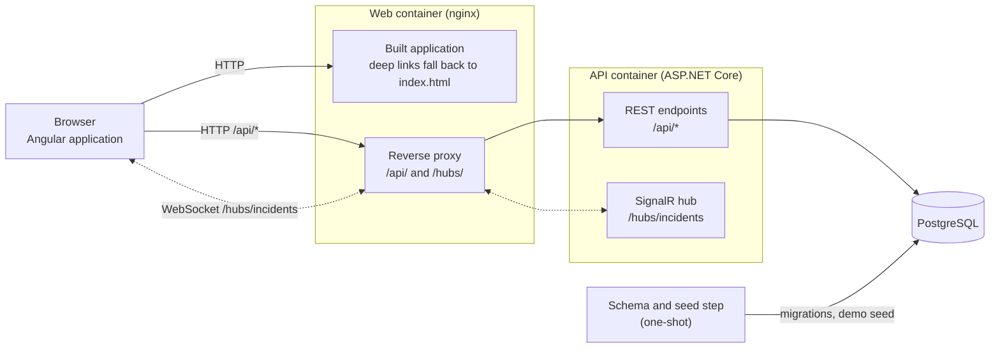
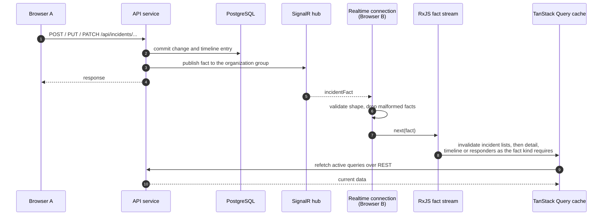

# Architecture

Scope: how OpsBoard's parts fit together at runtime, how the backend is layered, and how a change reaches other open browsers. Setup and commands live in the [README](../README.md).

## System

OpsBoard is an Angular single-page application in front of an ASP.NET Core API, with PostgreSQL as the system of record. The browser only ever talks to one origin. In the container stack, an nginx web container serves the built application and proxies `/api/` and `/hubs/` to the API. In local development, the Angular dev server plays the same role through its proxy configuration. The frontend therefore holds no API address: every request and the realtime connection are origin-relative.



The API does not change its own schema on startup. Migrations are applied by a separate step, a migration bundle built into the API image. In the container stack a one-shot service runs it, then runs the demo seed, and the API starts only after that step succeeds.

## Backend layers

The backend is four projects with dependencies pointing inward:

```text
OpsBoard.Api  ──►  OpsBoard.Application  ──►  OpsBoard.Domain
     │                    ▲                        ▲
     └──►  OpsBoard.Infrastructure ────────────────┘
```

- **Domain** holds the entities (organizations, teams, users, services, incidents, responders, timeline entries), the severity, status, health, role and timeline enums, and the rules that guard them, such as which incident status transitions are allowed. It references no other project and no vendor package.
- **Application** holds the use cases as services, their request and response contracts, validation, the error types the API maps to responses, and the interfaces it needs from outside: the current user, data access and write sessions, and the realtime publisher.
- **Infrastructure** implements those interfaces with EF Core and PostgreSQL: entity configurations, migrations, queries, the deterministic demo seed, and the demo identity.
- **Api** is the composition root: HTTP endpoints, the SignalR hub and its publisher, error mapping, and dependency registration.

Identity is a seeded demo user named by configuration. Every request resolves that user and its organization on the server, and each service enforces role permissions and organization boundaries itself. The identity sits behind an interface so a token-based identity provider can replace it without touching the use cases.

## Realtime flow

Realtime messages are notifications, not data. After a change is committed, the API sends a small *fact* naming what happened, which incident, and its new version numbers. Only connections in the same organization receive it. The client does not apply the fact's content to its state. It invalidates the affected server-state queries, and TanStack Query refetches them through the ordinary REST endpoints. The database stays the single source of truth, and a missed or duplicated fact cannot leave the screen holding data the API never served.



The facts cover incident creation, detail edits, severity and status changes, resolution and reopening, responders joining and leaving, and written updates. Publishing happens after the commit and never fails a request: if a fact cannot be sent, the error is logged and the change still stands.

On the client, one connection is started when the application starts and is shared by every page. While the connection is down, the shell shows its state. When it comes back, the client invalidates every incident query instead of trusting that nothing was missed. Reconnecting uses a fixed backoff and gives up after a bounded number of initial attempts.
